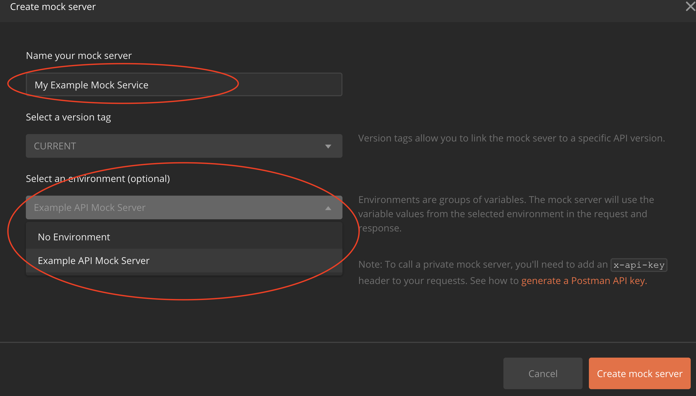

# Test Driven API Design Postman Collections

This project contains a set of postman collections and environments that provide a template for creating a new, test driven, API Design using Postman.   Postman users can load these files into Postman and explore the collections to better understand how to create an API design in postman, how to view the APIs automatically generated documentation, how to create example responses, how to create a mock service, and finally how to write tests that run against the mock service.

## Why do Test Driven API design with Postman?

Today, most APIs, if they are designed at all before implemtation, are designed using a "flat" API Schema language such as Swagger or OpenAPI.  API Design reviews consist of people reading this document and trying to imagine how a real world developer might string together a set of API calls to perform certain tasks.  Since it becomes hard to keep this all in your head, most design reviews focus less on "will this API meet the requirements" and more on "hmm, I don't know if I agree with that parameter name..." or something else as inconsequential.  Furthermore, while API designs will often capture an example payloads for a "happy path", 200 Status Code, responses, these design documents almost NEVER cover what the API behavior should be when an inevitable error occurs.  Since engineering teams never got these requirements in the specification, the result is often dramatically different error response behavior from implementation team to implemtation team.

Designing an API in Postman on the other hand allows a designer to work within a tool that many people actually use to call APIs with in real life.   As they design the API, they can start thinking about how a real world developer would string these APIs together to perform real world tasks, and actually build test collections to do just that.

Postman provides a rich set of tools to help bring this iterative API design process alive including:
* dynamically generated, always up-to-date documentation
* the ability to create multiple "example responses" for each API endpoint
* the ability to run a "mock service" can be used to create tests
* the ability to write test cases to inspect API responses and validate API behavior
* the ability to use dyanmic "environments" that make it easy to switch between testing against a mock server to testing against a real implementation of the design

In this project we'll walk through the process of creating two Postman collections (and one Postman environment) in a templatized way that can be used as the basis for applying this process to any new or existing API.   We will work with:

* An "API Blueprint" collection.  This collection will include one request for each HTTP Verb/API Endpoint combination.   The collection and requests will include the human readable documentation of the API as well as a set of "example responses" that will document the specific behavior that the API will have based on various types of input.   The combination of API definition and example responses in this collection will allow us to generate documentation and run a mock service to exercise our API at design time.
* An "API Contract Tests" collection.  This collection will include a set of requests to exercise the API.   By writing tests during the design phase we can exercise potential real world calling situations and catch and iterate on the design as we find areas where it doesn't quite work as expected.   Each test request can include a set of pre and post request test cases that validate the behavior worked as expected.
* A "Test Environment" collection that allows us to create and maintain a set of environment variables that are easily modified allowing us to use the same tests that we created during the design phase, against subsequent implementations of our API.

With the tests and design in hand, implementation teams can build the API based on the design and run the tests against the implementation to validate that the implementation matches the design spec.   Using Postman's CLI tool `newman` the tests can be used during a continuous integration process to regularly validate that the API is performing according to the specification.  Finally, after release, the test collections can be shared with support teams, customers, blog posts, etc to enable the community to learn about and take advantage of your new API.

## Loading the collections and environment in Postman
To get started we will load three collections into Postman:

1) Example API Blueprint.postman_collection.json
2) Example API Contract Tests.postman_collection.json
3) Example API Mock Server.postman_environment.json

The remainder of the collections in this project are our "advanced topics".

If you are unfmailiar with Postman, begin by clicking the "Import" button, and choosing the "Choose Files" button:

When imported succesfully you should see two new collections in postman, and a new Mock Service Environment available in the Environments dropdown:

## Creating Documentation from a Blueprint collection
After expanding the Example API Blueprint collection, click on the "three dots" on the folder and select edit to view the description of the folder.   This description will become the main documentation for the API:

In addition to the description tab, you will also see two other tabs with a "green dot" which Postman provides to let you know that there is content in those sections.   We'll come back to those tabs later as we built out our mock service.

After familiarizing yourself with the summary documentation for our Example API, exapnd the collection so that you can see see five "Requests" that encapsulate the basic functionality commonly exposed by many REST APIs in the Developer ecosystems:
  * List Examples
  * Get Example Details
  * Create new Example
  * Modify existing Example
  * Delete Example

Click on one of the requests in the collection and then click on the triangle next to the collection name to open up its complete description:

Finally, in the List Examples request view, click on the "Parameters" tab, to see how the query parameters for this API are documented:

Now that you have a basic understanding of how to document your API using Postman, feel free to modify the content of this collection to align more closely to your own API.   Change instances of "example" or "examples" to your own named endpoint, and create appropriate parameters and example request bodies for your requests.

## Viewing the Online Documentation

At anytime when editing a Postman collecion you can view the online documentation.  While your project may or may not ever plan to use the postman generated doc for your public documentation, it is certainly handy to have this to refer to during the initial API Design process.  

Click on the "triangle" above the "three dots" in the Collection Folder to bring up "Tools" that are availabe with any Collection.  From here click on the "View in web" button:

## Creating a Mock Service

Now that you have documentation for your API, its time to create a Mock Service that you can use to write tests for your API.   A Mock Service will respond to requests that you have documented and, if created, provide one of the Example responses that are included in your blueprint.

Let's take a look at an example response in our collection.  Click on the List Examples request and select the "Success: Get empty list of examples" example:

We will spend more time on Examples in a bit, but for now it's helpful to have a basic understanding of them.   Each example inlcudes the following key elements:
* Name -- you define this when you create the example and can add it to your tests, to request this response when working with a mock service
* URL -- this is your API endpoint that this response is associated with.  We'll talk about the `{{url}}` variable in a moment.
* Headers -- you can specify any headers that you expect in a request or that you want to return with a response.  In most cases you will focus primarily on response headers, so that you can later write tests that validate that the service is returning the expected response headers
* Status -- the response code that your mock service will return
* Body -- A response body that you create.  Don't forget to set the response type to JSON since all REST APIs return JSON!

As you can see there are many more example responses to explore, but for now let's focus on getting your mock service up and running so you can begin to explore the Contract Tests collection.   As you did when viewing the online documentation, click on the "triangle" in the Collection folder to bring up the "Collection Tools".  This time we will set up a mock service by clicking on the Mocks tab and choosing the "Create a Mock Server" button:

Give your Mock Services a name, and make sure to select our recently imported "Example API Mock Server" environment:  

Once that is done click, click the "Create a Mock Server" button.  This will bring up a page where you can click on the newly created Mock URL:

This will bring you back to the "Collection Tools" where you can click on the Copy icon to copy the Mock Service URL:

Finally, we need to modify our environment to call the mock service.   In the upper right hand corner make sure that the "Example API Mock Server" environment is selected in the drop down and click the "eye" icon next to it go get a quick view.  From here you can modify the value of the `url` environment variable.  (Since there are several variables in our environment, you may need to scroll up to find the url variable which should be at the top).  Hover over the "Current Value" field for the url variable and click the "pencil" icon to modify it.   Paste in the newly created mock services URL:

You are now ready to start making Test Requests against the Mock Service!

## Running the Example Contract Tests

Expand the collection called "Example API Contract Tests".  This collection inlcudes a set of requests and each requests includes tests that validate the responses.   In the "Happy Path" tests, the requests are "chained" together, and are built with an expectation that a user starts with a blank slate, and then creates, modifies and deletes new "Example" objects.   The "Negative Test Cases" validate that the server returns appropriate non 200 OK response codes and response bodies under anticipated failure conditions.  As you did before click on the "three dots" and choose "edit" so that you can read the description for this collection for more details.

The first request in the "Happy Path Tests" folder makes a request to the "List Examples" API and expects the server to return back and empty list.   Remember the example response wtih an empty list that we created before?  For this test request we add a new header `x-mock-resonse-name`, that instructs our mock server to return the response that has that name.  

Running this request against our mock server with this response allows us to write test cases that validate that the response coming back from the server is as expected.  Later when we want to run this same test against an actual implementation, we simply change the `url` environment variable to point to the location where the API is running.   An integration or a production API service should ignore the `x-mock-response-name` header.

Making sure that the "Example API Mock Server" environment is active, click the "Send" button to send the request to our Mock Server.  You should see a 200 OK response and our expected empty list as your response

Notice there is also a tab in the results section that says "Test Results 7/7".   By clicking on this tab we can see all the tests that ran once we got this response:

For this particular request we ran 7 tests. 5 of the tests were defined at the "Happy Path Tests" folder level which means that they will run for every test in the folder.   Defining common tests at the folder (or collection level), is a good practice that helps eliminate copy and paste errors.   To see the common tests, click on the "three dots" in the "Happy Path Tests" folder and choose edit.  Click on the "Tests" tab to see the tests which are written in javascript.  It's beyond the scope of this project to discuss how to create Postman tests, but here are some good resources to review:

* [Writing Tests in Postman — Postman Blog](https://blog.getpostman.com/2017/10/25/writing-tests-in-postman/)
* [Postman API Tests Documentation](https://documenter.getpostman.com/view/1559645/RzZFCGFR?version=latest)
* [API Tests in 3 Easy Steps — 20 minute video](https://www.youtube.com/watch?v=Qlvbc6kIBOk) — test related content starts at 2:10 minute mark.

We can also define request specific tests.  To view these tests simply click on the "Tests" tab under the request definition (near the top):

You can now click through the rest of the requests to analyze how they work.  Remember that the `x-mock-response-name` header will be set to an Example response that was defined in the Example API Blueprint collection.   To see the details of that example response, click on the appropriate API definition in the Blueprint folder and select the example response from the "Examples" dropdown in the upper right.

Notice that some tests use the commands `pm.environment.get()` or `pm.environment.set()` functions.   These tests either use or set environment variables.   It's worth taking a moment to talk about the environment variable naming conventions that we use on this proect:

  * test_* -- by convention, when our requests will send parameters or request bodies with key/values pairs we will use variables named test_*.  Inspect the companion environment file or the requests to find all instances of variables with this naming convention and set these as appropriate for the API under test.
  * stub_* -- by convention, these define response values typically set by the server.  These need to be set when testing with a mock service. They are unused when testing with a real service.
  * _* -- by convention these "temporary" variables are set by the tests themselves, and are used to compare results across requests.   The "Cleanup" folders delete these variables after a set of tests have been run.

## Running all the tests with the runner

Now that you are familiar with running the tests one-by-one, try running them all together using Postman's Runner.

Click the arrow on the Contract Tests Collection to bring up the Collection Tools and click the blue "Run" button.  This will open a new Runner window:

The Runner should have pre-selected the Contract Tests collection, and your Mock Service environment.   If not select these and then hit the blue Run button at the bottom.  This will start the run:

This view allows you to watch as all of your tests run, and jump to any failed tests so that you can debug the test or the services as needed.   While it is beyond the scope of this project, the runner also includes links to documentation and instructions on how these tests can be run from the command line as well.

## Implementing and Testing your API in a Continuous Integration environment

Once you have your tests working and have convinced yourself that your API definition will meet your requirements its time to hand everything over to an implementation team.   Many implementation teams can work directly with your API Blueprint collection as their requirements.  Others might prefer to have a more traditional specification.   Postman doesn't natively provide tools for exporting blueprint collections to other formats like Swagger or OpenAPI but there are several third party tools available for doing this, the most popular being the [APIMatic Transformer](https://www.apimatic.io/transformer/).

Regardless of what format you provide your implementation team with, you will be giving them a **FULLY SPECIFIED** description of what your API should provide.   Since you created tests to demonstrate that you can meet your requirements you will have caught weaknesses in the design BEFORE the team implmented the wrong thing.   Since you created Negative Test Cases, your implementation team will have requirements that explain to them clearly how the API should respond in these scenarios.

Finally, you have given your implementation team a set of test cases that they can run to ensure that the API is working to spec.  In early development, the implementation team will likely use Postman to run your Contract Tests collection (or even individual requests) against the implmentation, simply by specifying the `url` and `TOKEN` environment variables.   But as the API matures, then can turn those tests cases into a step in their Continuous Integration workflow, as Postman provides a CLI tool called Newman that can run automted tests.   More details are here:

* [Integrate API tests with Postman and Newman](https://blog.getpostman.com/2017/08/23/integrate-api-tests-with-postman-newman-and-travis-ci/)
* [How to write powerful automated API tests with Postman, Newman and Jenkins](https://blog.getpostman.com/2015/09/03/how-to-write-powerful-automated-api-tests-with-postman-newman-and-jenkins/)

## Final thoughts and Advanced Topics

Designing an API with Test Cases in Postman is likely to be a more time consuming task than simply sitting down with a text editor and creating an API Spec, but I'm convinced that the time spent up front is well worth it.  It is much more cost effective to find mistakes and iterate on your API design during the design phase, than it is to ask teams to change an existing implementation.

Also, since it is relatively easy to share Postman collections, I encourage API teams to share their Contract Tests with the customers that they worked with when originally collecting the requirements early on.   These customers can often exercise your API against your mock service and give you feedback early on, again saving you development costs and time.   Even after your API has been implemented, having a Postman collection of tests keeps paying dividends.  You can share it with support teams, and blog about it as you make the world aware about the availability of your new API.  Postman collections are a GREAT way for developers to learn about your API.

Finally, its worth admitting that there are parts of this process that are still kludgy.  It isn't easy to build a lot of example responses.   The Postman GUI doesn't provide a "Save As" button or a "Duplicate" button that would make it easy to modify existing examples.   To get around this we have also included a collection that demonstrates how the Postman API can be used to programatically copy and modify existing example responses.   In our example we want to replicate the "Happy Path Tests" as if a user with a diffferent role, who would use different request parameters and bodies was making the calls.  In our example a "designated partner Admin" can specify an "organization ID" that the API requests should operate in.     

At my company, we had seen that these "non primary user role" usage patterns were one of the most under-tested and frequently broken in our existing API suite.  Here again, building a set of tests to explicity validate it made sense.  And doing it during the design phase, so these test cases were explicitly covered in the requirements provide to our development teams, was much more cost effective than finding out after deployment that we had missed building and testing these flows.

Our collection [Mock: Generate New Mock Responses](.%2FMock-%20Generate%20New%20Mock%20Responses.postman_collection.json) demonstrates how you can create a new version of your API Blueprint with additional example responses in it programatically.   The collection [Example API Blueprint_with_partner_set_orgId](.%2FExample%20API%20Blueprint_with_partner_set_orgId.postman_collection.json), is the output of these scripts, and the collection [Example API Contract Tests With Partner Admin Tests](.%2FExample%20API%20Contract%20Tests%20With%20Partner%20Admin%20Tests.postman_collection)

For more details on using the Postman API to create mocks check out:
* [Fake it till you make it: mocks for agile development](https://medium.com/better-practices/https-medium-com-postman-engineering-fake-it-till-you-make-it-mocks-for-agile-development-f4d050cad694)
* [Fake APIs for Real Developers -- Video](https://youtu.be/fgtDZPOPzLU)
